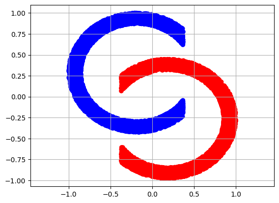
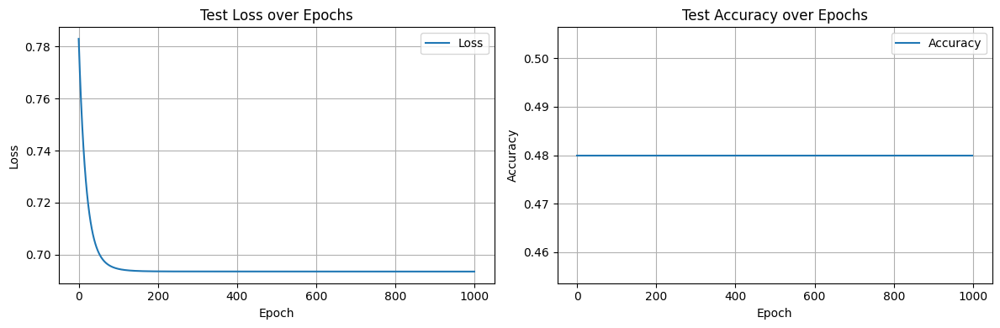
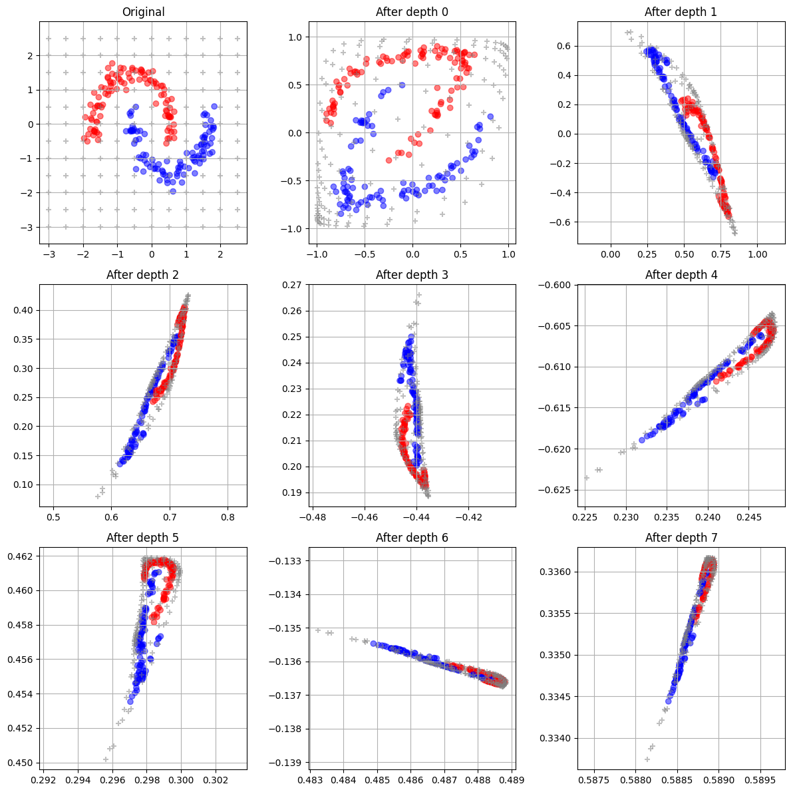
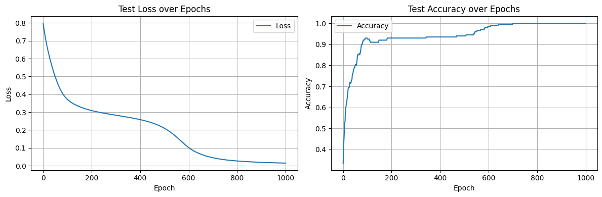
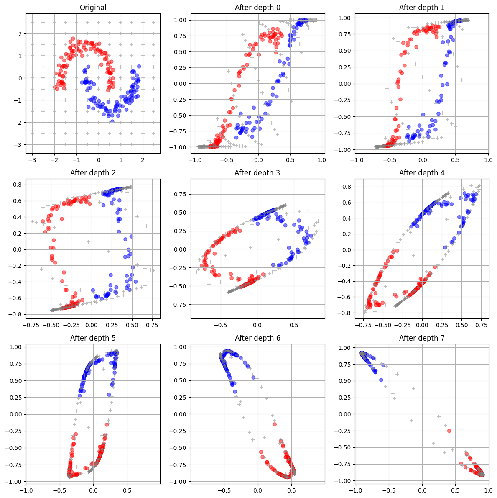

# The value of initialization

I started reading [The Little Book of Deep Learning by Francois Fleuret](https://fleuret.org/francois/lbdl.html)

One of the first example is about classifying data that looks like the yin and yang.

## First results

I set up my deep neural network as explained in the book: 
- 8 layers of size 2×2
- tanh activation applied component-wise
- a final classification layer

I expected this small problem to be solved with 100% accuracy pretty quickly.

It didn’t happen.
The loss decreased, but accuracy plateaued far below perfection:

## What could be wrong?

I started troubleshooting:

- **Vanishing gradients?** — Yes, gradients became tiny after just a few iterations.
- **Data normalization?** — Initially missing, and while it caused other issues, it wasn’t the main culprit here.
- **Training loop?** / optimizer / learning rate / batch size? — Unlikely. When I switched to a larger model (e.g., 1 hidden layer of size 8), training worked fine.
- **Random chance?** — Sometimes the model did reach 100% accuracy, but inconsistently.

What really stood out: after a few layers, the data collapsed onto a single line:

## Orthogonal Initialization

I experimented with initialization methods. Xavier didn’t help much.

The breakthrough came with orthogonal initialization. As soon as I applied it, the network became much more reliable and reached 100% accuracy consistently

We can see the different transformation of the space are clearly separating the blue / red data making it easy for the final layer to discriminate between the 2.

Visualization showing the effect of the layers on the data:

Orthogonal initialization sets the weight matrix so its rows (or columns) are orthogonal vectors.

**Key property:** Orthogonal matrices preserve variance — they don’t change the length of a vector (up to a scaling factor). This helps keep activations and gradients from exploding or vanishing, even across many layers.

By preserving the spread of the data in early layers, the network keeps more useful information for the later ones — which is exactly what fixed my yin–yang classification problem.